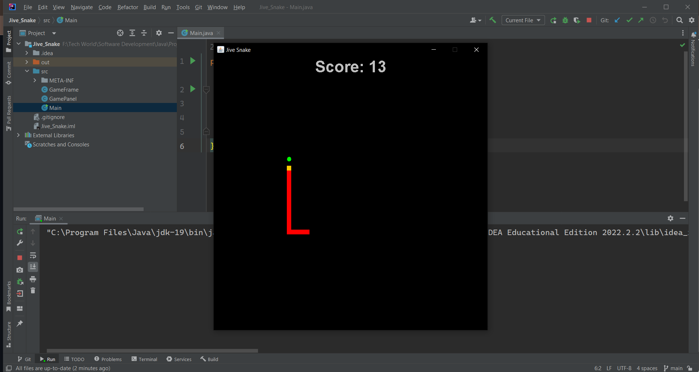

# Jive_Snake

MyJive Snake is a classic Snake game built using Java Swing. It offers a nostalgic gaming experience where you control a snake, eat food, and try to grow as long as possible without colliding with walls or yourself.

## Features

- Classic Snake gameplay.
- Intuitive controls using arrow keys.
- Score tracking to keep track of your progress.
- Speed increases as the snake grows, making the game progressively challenging.
- Game over when the snake collides with walls or itself.

## Screenshots



## Getting Started

These instructions will help you get a copy of the project up and running on your local machine for development and testing purposes.

### Prerequisites

- Java Development Kit (JDK) installed on your machine.
- Git installed on your machine (optional, if you want to clone the repository).

### Installation and Running

1. Clone the repository (or download the ZIP file and extract it):

   ```bash
   git clone https://github.com/Sandile-Dev01/Jive_Snake.git
   ```

2. Navigate to the project directory:

   ```bash
   cd Jive_Snake
   ```

3. Compile the Java source files:

   ```bash
   javac *.java
   ```

4. Run the game:

   ```bash
   java Main
   ```

5. Use the arrow keys to control the snake (Up, Down, Left, Right).
6. Enjoy the game!

## Controls

- Use the **Up**, **Down**, **Left**, and **Right** arrow keys to control the snake's direction.
- Press **Q** to quit the game at any time.

## Contributing

If you'd like to contribute to my Jive Snake, please follow these steps:

1. Fork the repository on GitHub.
2. Create a new branch for your feature or bug fix: `git checkout -b feature-name`.
3. Make your changes and commit them: `git commit -m "Add new feature"`.
4. Push your changes to your fork: `git push origin feature-name`.
5. Open a pull request on the original repository.

## Acknowledgments

- Thanks to the Java Swing library for making it easy to create graphical user interfaces.
- Inspiration from classic Snake games.

## Contact

If you have any questions or suggestions, please feel free to contact us at [ndimandesandile778@gmail.com](mailto:ndimandesandile778@gmail.com).

Enjoy the game! 🐍🎮
